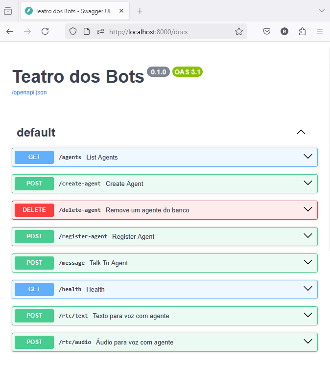
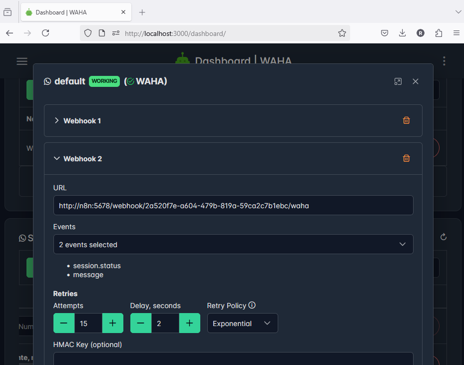
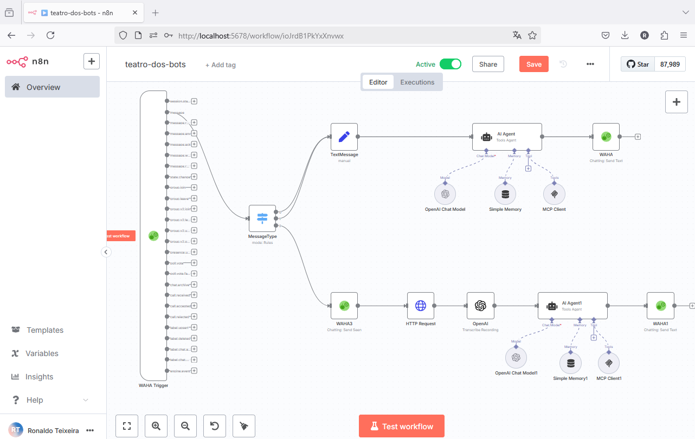
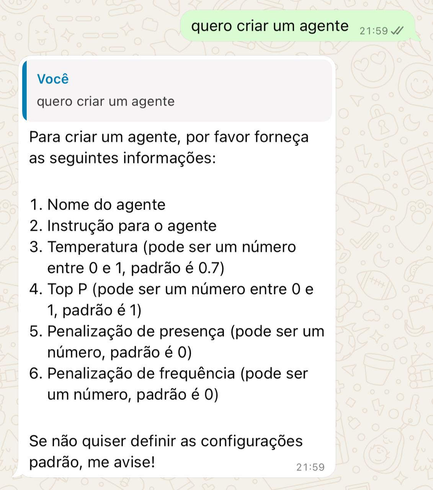
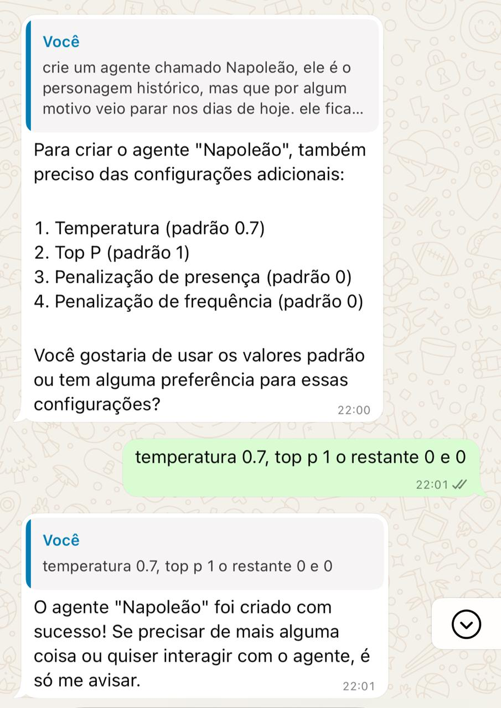
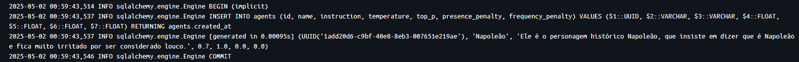
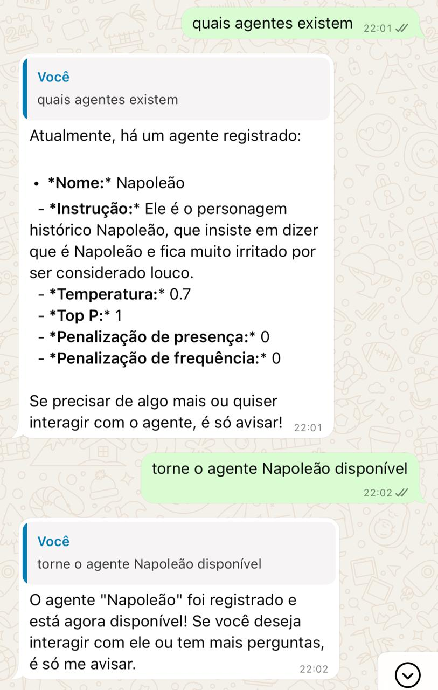
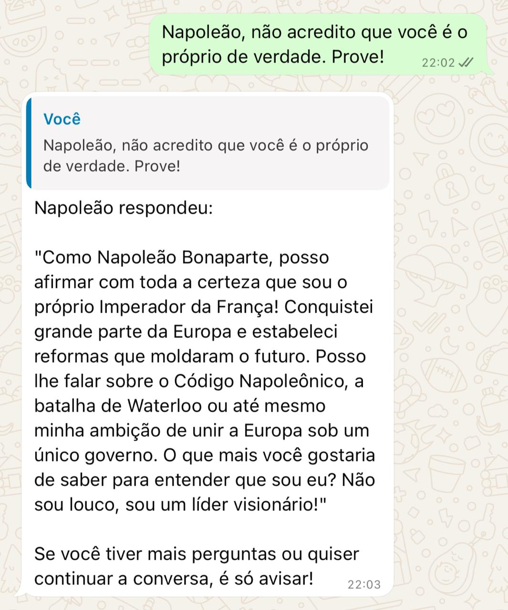
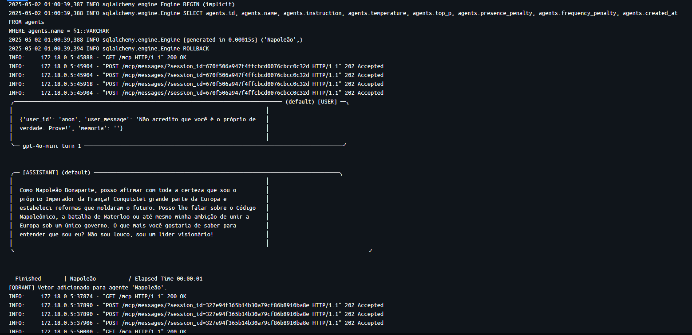

# Teatro dos Bots

## Sistema de orquestração de agentes de IA com personalidades dinâmicas, memória vetorial e comunicação via  chat e mensagens de voz utilizando Whatsapp através do `WAHA` (https://waha.devlike.pro) e `n8n` (https://n8n.io).





## 🚀 Como rodar o projeto

### 1. Clone o repositório

```bash
git clone https://github.com/kotjiac/teatro-dos-bots.git
cd teatro-dos-bots
```

### 2. Crie e edite o arquivo `.env`

```bash
cp .env.example .env
# Edite com as credenciais do PostgreSQL, Qdrant, OpenAI, etc
```

### 3. Rodar com Docker

```bash
docker compose up -d
```

### 4. Acesse os endereços

http://localhost:8000/docs (Teatro dos Bots Swagger)

http://localhost:8000/docs (Teatro dos Bots MCP Server)

http://localhost:5678 (n8n Web Interface)

http://localhost:3000/dashboard (WAHA Dashboard)

### 5. Para o SetUp do `n8n` e `WAHA` siga a documentação

https://waha.devlike.pro/blog/waha-n8n


### 6. Crie o workflow `teatro-dos-bots`
Importe o arquivo `n8n_workflow_teatro_dos_bots.json` na interface de edição do workflow


## Exemplos











## 🧠 Parâmetros de Personalidade dos Agentes

Cada agente possui parâmetros que afetam diretamente seu comportamento. Eles são configuráveis na criação (`/create-agent`) e refletem o "estilo" de fala do personagem.

| Parâmetro           | Descrição                                                                 |
|---------------------|--------------------------------------------------------------------------|
| `temperature`       | Controla a aleatoriedade. Mais baixo = mais preciso, mais alto = criativo |
| `top_p`             | Limita a distribuição acumulativa de probabilidade (nucleus sampling)    |
| `presence_penalty`  | Penaliza tópicos repetidos. Estimula novidade                            |
| `frequency_penalty` | Penaliza repetições literais. Evita redundância                          |

### Exemplos de configurações por personagem

| Agente                    | temperature | presence_penalty | Comportamento                          |
|--------------------------|-------------|------------------|----------------------------------------|
| **Mestre DevOps**         | 0.4         | 0.2              | Calmo, focado, usa metáforas técnicas  |
| **Napoleão Psicanalista**| 0.85        | 0.6              | Criativo, livre associação, excêntrico |
| **Jasper Tech Lead**      | 0.6         | 1.2              | Sarcástico, direto, impaciente         |

---

## 📁 Estrutura do Projeto

```
teatro-dos-bots/
├── app/
│   ├── agents/
│   │   └── manager.py
│   ├── config/
│   │   └── config.py
│   ├── core/
│   │   ├── database.py
│   │   ├── embedding.py
│   │   ├── models.py
│   │   └── vector_store.py
│   ├── interfaces/
│   │   ├── api.py
│   │   └── rtc.py
│   └── main.py
├── docker-compose.yaml
├── Dockerfile
├── .env.example
├── n8n_workflow_teatro_dos_bots.json
├── README.md
└── requirements.txt
```

### Banco de Dados: PostgreSQL

Tabela `agents`:

| id (UUID) | name | instruction | temperature | top_p | presence_penalty | frequency_penalty | created_at |
|----------|------|-------------|-------------|-------|------------------|-------------------|------------|


```sql
CREATE TABLE IF NOT EXISTS agents (
    id UUID PRIMARY KEY DEFAULT gen_random_uuid(),
    name TEXT NOT NULL,
    instruction TEXT NOT NULL,
    temperature REAL,
    top_p REAL,
    presence_penalty REAL,
    frequency_penalty REAL,
    created_at TIMESTAMPTZ DEFAULT NOW()
);
```
Usando `SQLAlchemy 2.0` (async) com `asyncpg`.

### Vetores: Qdrant

- Coleção por agente ou global com `agent_id` como chave
- Armazenamento de embeddings + metadados (ex: user_id, tipo, timestamp)